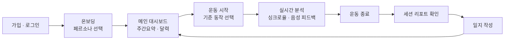
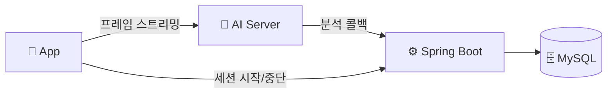
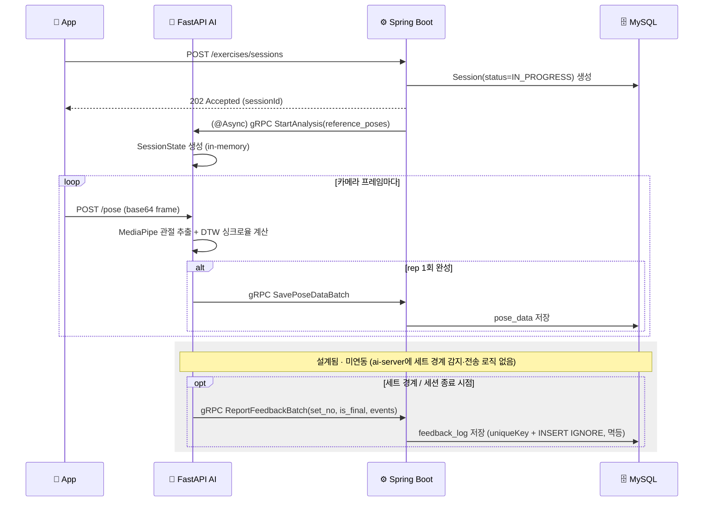
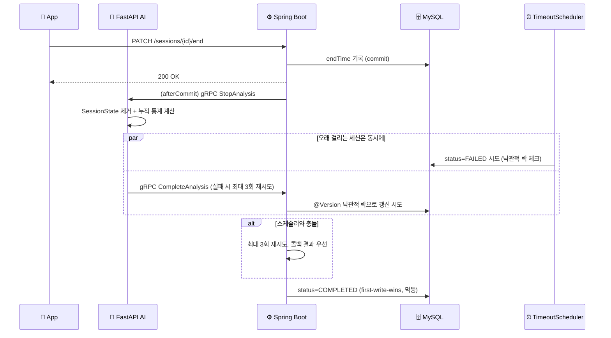
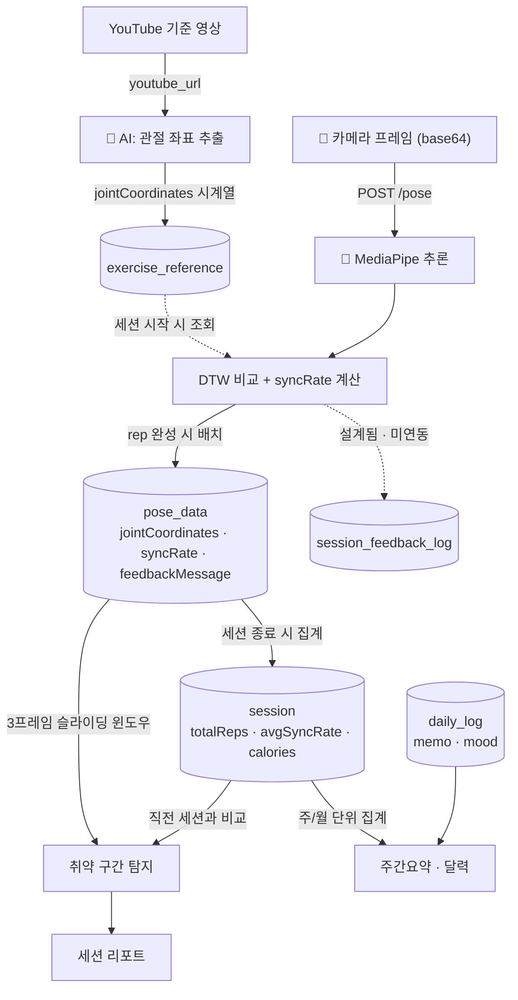

# 🏋️ ShadowFit

**카메라로 찍은 내 운동 자세를, 정답 동작과 실시간으로 비교해주는 홈트레이닝 앱**

사용자가 스마트폰 카메라로 스쿼트 동작을 촬영하면, AI 서버가 자세를 추출해 기준(레퍼런스) 동작과 시계열로 비교(DTW)하고, 그 결과를 실시간 피드백(음성 안내 포함)으로 되돌려줍니다.
React Native 앱 ↔ Spring Boot 백엔드 ↔ FastAPI AI 서버가 gRPC로 연동되는 구조입니다.

---

## 📖 사용자 여정

1. **가입 & 온보딩** — 이메일로 회원가입 후, 온보딩에서 페르소나(헬린이·헬창·다이어트·재활)를 선택합니다. 이후 피드백 톤과 싱크로율 기준이 이 페르소나에 맞춰집니다.
2. **메인 대시보드** — 이번 주 운동 요약(총 운동시간·칼로리·요일별 그래프)과 달력으로 최근 운동 현황을 확인합니다.
3. **운동 시작** — 운동(현재는 스쿼트)을 선택하면, 등록된 기준 동작(YouTube에서 사전 추출된 관절 좌표)을 기준으로 세션이 시작됩니다.
4. **실시간 분석** — 카메라로 촬영한 프레임이 AI 서버로 전송되고, 관절 좌표 추출 → 기준 동작과 DTW 비교로 실시간 싱크로율이 계산됩니다. 자세가 기준을 벗어나면 등록된 피드백 멘트가 음성으로 안내됩니다.
5. **운동 종료** — 종료 버튼을 누르면 세션이 마감되고, AI가 집계한 최종 통계(총 반복 횟수·평균 싱크로율·칼로리)가 반영됩니다.
6. **결과 확인** — 세션 리포트에서 가장 자세가 흐트러졌던 구간과 이유, 직전 세션 대비 변화를 확인합니다.
7. **기록 남기기** — 오늘의 운동에 메모와 기분을 남기고, 다시 대시보드로 돌아가 흐름이 반복됩니다.

---

## ✨ 핵심 기능

| 기능 | 설명 |
| :--- | :--- |
| 🏃 **실시간 자세 분석** | MediaPipe로 관절 좌표를 추출하고, 기준 동작과 DTW(Dynamic Time Warping)로 시계열 비교해 싱크로율 산출 |
| 🎥 **기준 동작 매칭** | YouTube URL에서 기준 포즈를 사전 추출해 운동별 기준 데이터로 저장 |
| 🔊 **음성 피드백 안내** | 서버는 운동별 피드백 멘트·사용자 TTS 설정(속도/on-off)을 관리하고, 실제 음성 합성·재생은 클라이언트 device TTS(`expo-speech`)가 담당 |
| 🧑‍🤝‍🧑 **페르소나별 피드백 톤** | 헬린이 · 헬창 · 다이어트 · 재활 4가지 페르소나에 따라 다른 톤의 피드백 템플릿 제공 |
| 📅 **운동 기록 & 리포트** | 달력 기반 운동 일지, 세션별 리포트(취약 구간 분석, 이전 세션 대비 변화) 제공 |

> 🚧 **로드맵**: 적응형 난이도 자동 조절(성공/실패에 따른 레벨 승강), 스쿼트 외 운동(데드리프트·턱걸이) 확장은 설계 단계이며 아직 구현 전입니다.

**대표 API**

| Method | Endpoint | 설명 |
| :--- | :--- | :--- |
| `POST` | `/exercises/sessions` | 운동 세션 시작 (DB 생성 후 202 즉시 응답, gRPC 송신은 비동기) |
| `PATCH` | `/sessions/{sessionId}/end` | 세션 종료 (단일 엔드포인트, 커밋 후 AI에 비동기 통보) |
| `POST` | `/exercises/{exerciseId}/reference` | YouTube 기준 동작 좌표 추출 요청 |
| `GET` `PATCH` | `/preferences/tts` | TTS 사용 여부·속도 조회/변경 |
| `GET` | `/exercises/{exerciseId}/feedback-templates` | 운동별 피드백 멘트 조회 |
| `GET` | `/reports/calendar` | 달력 기반 월별 운동 기록 |
| `GET` | `/reports/weekly-summary` | 주간 활동 요약 |
| `POST` | `/reports/daily-logs` | 운동 일지 작성 |
| `GET` | `/reports/session/{sessionId}` | 세션별 상세 리포트(취약 구간·이전 세션 비교) |
| `PATCH` | `/admin/exercises/{exerciseId}/thresholds` | 페르소나별 싱크로율 임계값 조정 (관리자) |

전체 스펙은 백엔드 저장소의 Swagger(`/swagger-ui`) 참고.

**📊 리포트 기능 상세**

- **세션 리포트** (`GET /reports/session/{id}`)
  - *취약 구간 탐지*: 포즈 데이터를 3프레임 단위 슬라이딩 윈도우로 순회해 평균 싱크로율이 가장 낮은 구간을 찾습니다. 프레임 하나만 보면 일시적 노이즈에 흔들릴 수 있어 구간 단위로 판단하고, 해당 구간에서 가장 자주 나온 피드백 메시지를 이유로 함께 보여줍니다.
  - *이전 세션 대비 비교*: 같은 운동 종목의 가장 최근 완료 세션과 비교해 싱크로율·운동시간·칼로리 변화량을 계산합니다.
- **주간 요약** (`GET /reports/weekly-summary`) — 이번 주(월~일) 전체 세션을 집계해 총 운동시간·총 칼로리·요일별 그래프, 오늘 진행한 운동 목록을 제공합니다.
- **달력** (`GET /reports/calendar`) — 월 단위로 운동한 날짜와 날짜별 평균 싱크로율을 표시하고, 이번 달 총 운동일수·전체 평균 싱크로율·연속 운동일수(최근 100일 데이터 기준)를 함께 보여줍니다.
- **운동 일지** (`POST /reports/daily-logs`) — 날짜별 메모와 기분(mood)을 기록하며, 이미 작성된 날짜면 덮어씁니다(upsert).

---

## 🧩 아키텍처

프론트는 카메라 프레임을 AI 서버에 직접 스트리밍하고, AI 서버는 gRPC 콜백으로 결과를 Spring에 전달합니다. 세션 시작/중단만 프론트→Spring→AI로 한 단계 거칩니다.

## 🔁 세션 라이프사이클 시퀀스

### ▶️ 세션 시작 & 실시간 분석

프레임마다 AI가 rep 완성 여부를 판단해 완성된 rep만 Spring에 배치로 콜백합니다. TTS 발화 이벤트 배치(`ReportFeedbackBatch`)는 Spring 계약은 완료됐지만 AI 서버 쪽 세트 경계 감지·전송 로직은 아직 구현 전입니다.

### ⏹️ 세션 종료 & 동시성 처리

세션 종료 콜백이 지연되면 `SessionTimeoutScheduler`가 만료 세션을 `FAILED` 처리 시도하지만, AI의 `CompleteAnalysis` 콜백과 동시에 충돌하면 `@Version` 낙관적 락 재시도 후 콜백 결과를 우선합니다(first-write-wins, 멱등).

## 🔀 데이터 플로우

카메라 프레임은 AI 서버 내부에서 관절 좌표로 변환된 뒤 rep 단위로만 Spring에 저장되고, 세션 리포트·주간요약·달력은 모두 이 `pose_data`/`session` 테이블에서 파생됩니다.

---

# 🛠️ 기술 스택

## 📱 Frontend

| 역할 | 종류 |
| :--- | :--- |
| **Framework & Runtime** |     |
| **Language** |  |
| **State & Networking** |    |
| **Storage** |   |
| **UI & Interaction** |       |
| **Device & Media** |       |

---

## ⚙️ Backend

| 역할 | 종류 |
| :--- | :--- |
| **Language** |  |
| **Framework** |   |
| **Database / ORM** |    |
| **Security** |   |
| **API Docs** |  |
| **Service 간 통신** |   |
| **Utilities** |   |

---

## 🤖 AI Server

| 역할 | 종류 |
| :--- | :--- |
| **Language** |  |
| **Framework** |   |
| **AI / CV** |    |
| **Motion Analysis** |  |
| **Validation** |  |
| **Service 간 통신** |   |

---

## 🐳 Infra & 배포

| 역할 | 종류 |
| :--- | :--- |
| **Container** |   |
| **Web Server** |  |
| **Cloud** |  |
| **CI/CD** |  |
| **Service 간 프로토콜** |   |

