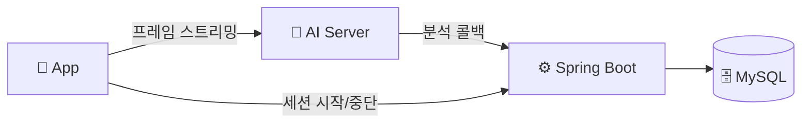
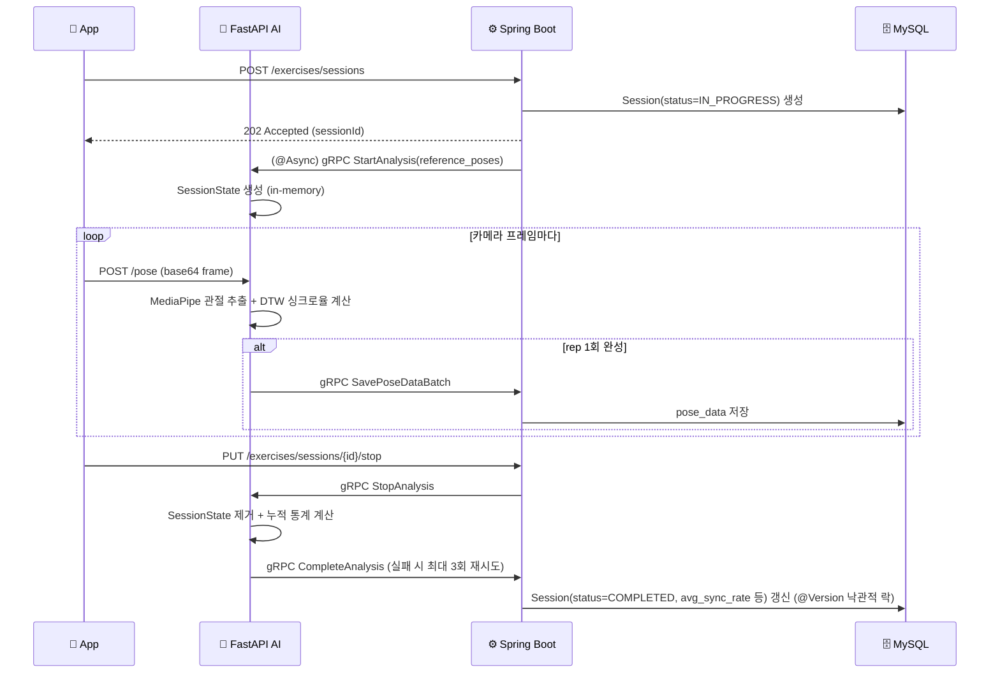

# 🏋️ ShadowFit

**카메라로 찍은 내 운동 자세를, 정답 동작과 실시간으로 비교해주는 홈트레이닝 앱**

사용자가 스마트폰 카메라로 스쿼트 동작을 촬영하면, AI 서버가 자세를 추출해 기준(레퍼런스) 동작과 시계열로 비교(DTW)하고, 그 결과를 실시간 피드백(음성 안내 포함)으로 되돌려줍니다.
React Native 앱 ↔ Spring Boot 백엔드 ↔ FastAPI AI 서버가 gRPC로 연동되는 구조입니다.

---

## ✨ 핵심 기능

| 기능 | 설명 |
| :--- | :--- |
| 🏃 **실시간 자세 분석** | MediaPipe로 관절 좌표를 추출하고, 기준 동작과 DTW(Dynamic Time Warping)로 시계열 비교해 싱크로율 산출 |
| 🎥 **기준 동작 매칭** | YouTube URL에서 기준 포즈를 사전 추출해 운동별 기준 데이터로 저장 |
| 🔊 **음성 피드백 안내** | 서버는 운동별 피드백 멘트·사용자 TTS 설정(속도/on-off)을 관리하고, 실제 음성 합성·재생은 클라이언트 device TTS(`expo-speech`)가 담당 |
| 🧑‍🤝‍🧑 **페르소나별 피드백 톤** | 헬린이 · 헬창 · 다이어트 · 재활 4가지 페르소나에 따라 다른 톤의 피드백 템플릿 제공 |
| 📅 **운동 기록 & 리포트** | 달력 기반 운동 일지, 세션별 리포트(취약 구간 분석, 이전 세션 대비 변화) 제공 |

> 🚧 **로드맵**: 적응형 난이도 자동 조절(성공/실패에 따른 레벨 승강), 스쿼트 외 운동(데드리프트·턱걸이) 확장은 설계 단계이며 아직 구현 전입니다.

---

## 🧩 아키텍처

프론트는 카메라 프레임을 AI 서버에 직접 스트리밍하고, AI 서버는 gRPC 콜백으로 결과를 Spring에 전달합니다. 세션 시작/중단만 프론트→Spring→AI로 한 단계 거칩니다.

## 🔁 세션 라이프사이클 시퀀스

세션 종료 콜백이 지연되면 `SessionTimeoutScheduler`가 1분마다 만료 세션을 `FAILED` 처리하지만, AI 콜백과 동시에 충돌하면 낙관적 락 재시도 후 AI 결과를 우선합니다.

---

# 🛠️ 기술 스택

## 📱 Frontend

| 역할 | 종류 |
| :--- | :--- |
| **Framework & Runtime** |    |
| **Routing** |  |
| **Language** |  |
| **State Management** |   |
| **Networking** |  |
| **Storage** |   |
| **Navigation & UI** |     |
| **Design & Graphics** |    |
| **Media & Device Features** |       |
| **Visualization & Components** |    |
| **Web Support** |   |

---

## ⚙️ Backend

| 역할 | 종류 |
| :--- | :--- |
| **Language** |  |
| **Framework** |   |
| **Database / ORM** |    |
| **Security** |   |
| **API Docs** |  |
| **Service 간 통신** |   |
| **Utilities** |   |

---

## 🤖 AI Server

| 역할 | 종류 |
| :--- | :--- |
| **Language** |  |
| **Framework** |   |
| **AI / CV** |    |
| **Motion Analysis** |  |
| **Validation** |  |
| **Service 간 통신** |   |

---

## 🐳 Infra & 배포

| 역할 | 종류 |
| :--- | :--- |
| **Container** |   |
| **Web Server** |  |
| **Cloud** |  |
| **CI/CD** |  |
| **Service 간 프로토콜** |   |

